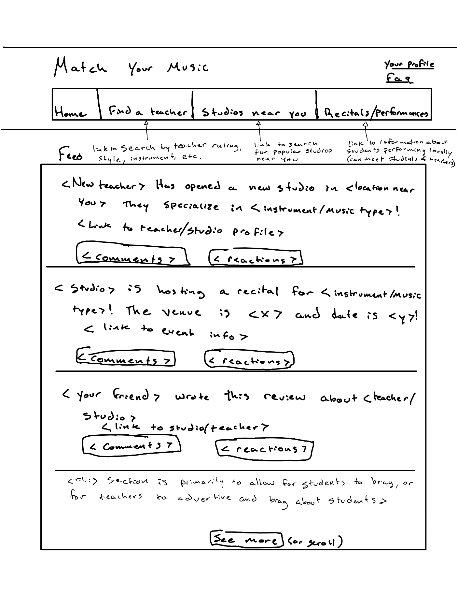

# Match your Music

[My Notes](notes.md) <!-- link to notes.md-->

### App description
I plan to make an app that will allow music teachers to find students in their area, and vice versa. The app will prioritize easy access information about a teacher's qualifications, accomplishments, teaching style, and the rating that their students give them. Ideally it would allow for students to have a greater amount of freedom when it comes to choosing teachers, in addition to allowing teachers to expand the number of people that are exposed to their studios.

<!-- This is a template for your startup application. You must modify this `README.md` file for each phase of your development. You only need to fill in the section for each deliverable when that deliverable is submitted in Canvas. Without completing the section for a deliverable, the TA will not know what to look for when grading your submission. Feel free to add additional information to each deliverable description, but make sure you at least have the list of rubric items and a description of what you did for each item. -->
<!-- If you are not familiar with Markdown then you should review the [documentation](https://docs.github.com/en/get-started/writing-on-github/getting-started-with-writing-and-formatting-on-github/basic-writing-and-formatting-syntax) before continuing. -->

## 🚀 Specification Deliverable

For this deliverable I did the following. I checked the box `[x]` and added a description for things I completed.

- [x] Proper use of Markdown
- [x] A concise and compelling elevator pitch
- [x] Description of key features
- [x] Description of how you will use each technology
- [x] One or more rough sketches of your application. Images must be embedded in this file using Markdown image references.

### Elevator pitch

My wife wants a music teacher dating app. Well, more realistically an app that matches music teachers to students in a strictly unromantic and purely professional way. My wife is studying music education, and as she nears graduation she has come to realize that finding voice students is a lot more difficult than by simply reaching out to family, friends, and community group chats. Her family members are all aware of her ability to teach, and are either taking lessons from her or lack the desire to do so. Likewise her friends are either involved in collegiate level studies of music, or lack the desire (or funds) to take lessons. Lastly, the community may know of her studies, but very few of them know her capabilities. When speaking with her about how to expand her pool of students, she often explains how difficult it is to expand her studio, and the influence that it has. As time went on we realized that posting ads on social media was resulting in next to nobody reaching out for lessons due to the problems explained earlier. Making a website for her studio would have just as little impact because of our inability to spread information about her. Because of this, we realized that it would be simpler to allow people already interested in voice lessons, if there was a website that allowed you to look for teachers in your area. Ideally this would improve the quality of music lessons by allowing students to choose teachers whose methods seem interesting to them. So more realistically the app would be like a yelp app for music teachers, not a dating app.

### Design

### Key features

- A function for students to find teachers based on certain filters
- A function for students to find studios that are close to them
- A function for students, parents, other teachers to attend recitals or performances of students

### Technologies

I am going to use the required technologies in the following ways.

- **HTML** - Organize the page into a home tab, search by teacher tab, search by studio tab, and tab for finding recitals in the area
- **CSS** - Make the app look simple, be intuitive to use, and allow for use by grandmas aged teachers and by brain rot aged students
- **React**  - Allow user to scroll through a feed, change tabs, search for teachers, add filters, etc.
- **Service** - Store posts for public and private viewing, allow users to sign in, maps to show locations of studios or events
- **DB/Login** - Store post information and profile information
- **WebSocket** - Allow people to create profiles and create or interact with posts

## 🚀 AWS deliverable

For this deliverable I did the following. I checked the box `[x]` and added a description for things I completed.

- [x] **Server deployed and accessible with custom domain name** - [My server link](https://matchyourmusic.com/).

## 🚀 HTML deliverable

For this deliverable I did the following. I checked the box `[x]` and added a description for things I completed.

- [x] **HTML pages** - I added a home, find a teacher, events, and profile page
- [x] **Proper HTML element usage** - I used different h tags, created different div classes to show what structures I want js to be able to create/mimic
- [x] **Links** - There is a link to my git repo, and each of the pages
- [x] **Text** - There is a lot of text, most is so that I can use them as templates for js functions.
- [x] **3rd party API placeholder** - Each event and teacher location will be clickable, this will pull a location up on google maps.
- [x] **Images** - I did put photos in, I hope you enjoy them. I even added a page logo.
- [x] **Login placeholder** - I did this.
- [x] **DB data placeholder** - I did this. Accounts will appear when people search for them.
- [x] **WebSocket placeholder** - I did this. Posts will appear as users create them.

## 🚀 CSS deliverable

For this deliverable I did the following. I checked the box `[x]` and added a description for things I completed.

- [x] **Header, footer, and main content body** - The header footer and main content are distinct, shown through coloring.
- [x] **Navigation elements** - The navigation elements are similar to the simon code, but I changed it to match the bootstrap examples.
- [x] **Responsive to window resizing** - The pages do adjust to window resizing, I still need to figure out how to stop the header from disappearing when the window gets too small.
- [x] **Application elements** - I made feed windows, as well as profile windows.
- [x] **Application text content** - I changed a few of the fonts, and italicized some of the text.
- [x] **Application images** - I made the profile pictures into thumbnail sized portraits. I need to figure out what style I prefer as the two images are slightly different.

## 🚀 React part 1: Routing deliverable

For this deliverable I did the following. I checked the box `[x]` and added a description for things I completed.

- [x] **Bundled using Vite** - I did this, everything should be included in the node_modules including bootstrap files.
- [x] **Components** - Each of the pages was switched from html to js, though I need to reformat the css for some of the pages, as the switch from HTML to js made some of the containers change color. 
- [x] **Router** - Each of the different pages display when you click on them iun the nav bar.

## 🚀 React part 2: Reactivity deliverable

For this deliverable I did the following. I checked the box `[x]` and added a description for things I completed.

- [X] **All functionality implemented or mocked out** - All of my search, edit, and post buttons have all functionality completed, except for database connections.
- [X] **Hooks** - Unless I misunderstand what hooks are, the components that I added would fit that description.

## 🚀 Service deliverable

For this deliverable I did the following. I checked the box `[x]` and added a description for things I completed.

- [ ] **Node.js/Express HTTP service** - I did not complete this part of the deliverable.
- [ ] **Static middleware for frontend** - I did not complete this part of the deliverable.
- [ ] **Calls to third party endpoints** - I did not complete this part of the deliverable.
- [ ] **Backend service endpoints** - I did not complete this part of the deliverable.
- [ ] **Frontend calls service endpoints** - I did not complete this part of the deliverable.
- [ ] **Supports registration, login, logout, and restricted endpoint** - I did not complete this part of the deliverable.

## 🚀 DB deliverable

For this deliverable I did the following. I checked the box `[x]` and added a description for things I completed.

- [ ] **Stores data in MongoDB** - I did not complete this part of the deliverable.
- [ ] **Stores credentials in MongoDB** - I did not complete this part of the deliverable.

## 🚀 WebSocket deliverable

For this deliverable I did the following. I checked the box `[x]` and added a description for things I completed.

- [ ] **Backend listens for WebSocket connection** - I did not complete this part of the deliverable.
- [ ] **Frontend makes WebSocket connection** - I did not complete this part of the deliverable.
- [ ] **Data sent over WebSocket connection** - I did not complete this part of the deliverable.
- [ ] **WebSocket data displayed** - I did not complete this part of the deliverable.
- [ ] **Application is fully functional** - I did not complete this part of the deliverable.
